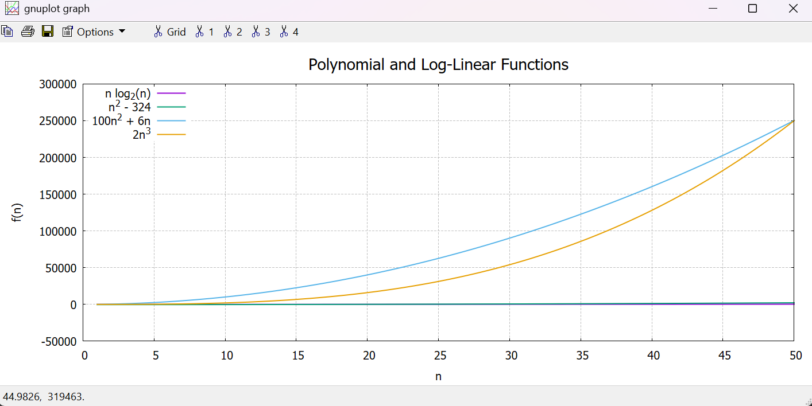
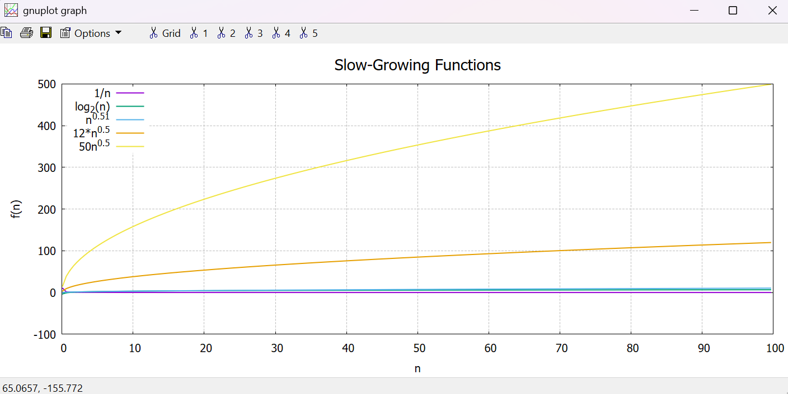
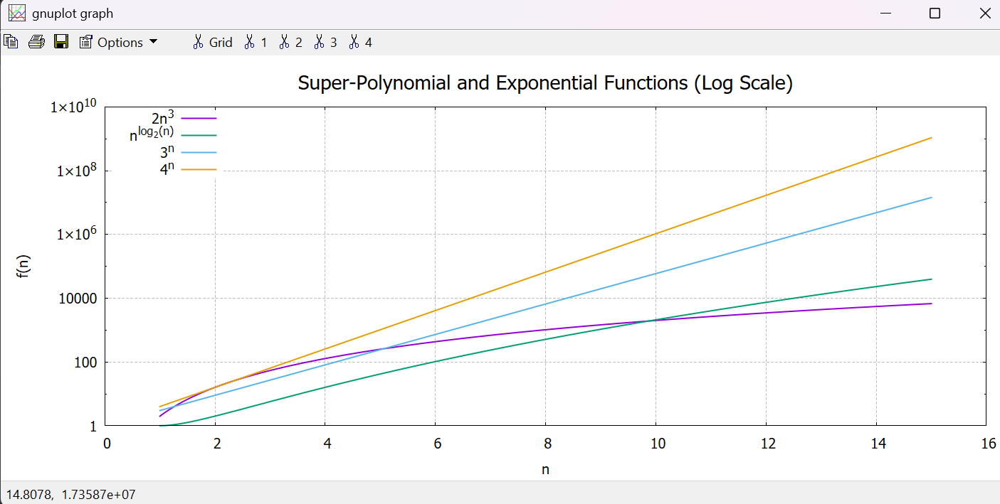

# Function Growth Analysis & Plotting (C + Gnuplot)

This project analyzes and visualizes the growth rates of different mathematical functions.  
It sorts them by order of growth, identifies pairs of functions with the same asymptotic behavior, and generates plots using **Gnuplot**.

---

## Algorithm Explanation

1. **Function Definitions**  
   - A set of mathematical functions is implemented in C (e.g., `1/n`, `log2(n)`, `sqrt(n)`, `n log2(n)`, `n^2`, `3^n`, `4^n`, etc.).  
   - Each function is stored in a struct with:  
     - a function pointer  
     - a display name  
     - a title for Gnuplot  

2. **Sorting by Growth Rate**  
   - Each function is evaluated at a large value of `n` (`N = 10000`).  
   - The results are compared, and functions are sorted in increasing order of growth using bubble sort.  

3. **Θ-Relation Detection**  
   - After sorting, the program prints pairs of functions that belong to the same asymptotic growth class (Θ-class).  
   - Example: `12*sqrt(n)` and `50n^0.5` are both Θ(n^0.5).  

4. **Plotting with Gnuplot**  
   - The program pipes data directly to Gnuplot.  
   - Functions are grouped and plotted as:  
     - Slow-growing functions  
     - Polynomial and log-linear functions  
     - Exponential and super-polynomial functions  
   - Logarithmic scaling is used where appropriate.  

---

## How to Run

You can either **run the provided executable** or **compile the program from source**:

1. Make sure you have installed:
   - **C Compiler** (gcc, clang, or MSVC)  
   - **Gnuplot** (needed for plotting)  

   📥 Download Gnuplot: [http://www.gnuplot.info/download.html](http://www.gnuplot.info/download.html)

